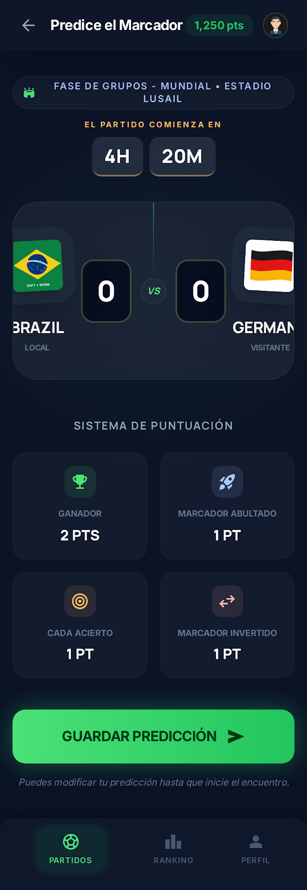

# Dashboard - Proposal 01

### Idea
Toda la información basica del partido en una pantalla, con quien y cuando, buscando full simplicidad.

### Decisiones
- Informacion relevante para el usuario, sobre todo el momento en el que comienza, que en teoria deberia ser el tiempo limite
- 2 cuadros grandes, para poner tu predicción
- Una breve explicación del sistema de puntos para que todo siempre este claro.

### Pros
- Va al grano
- Rápido de usar
- Tiene solo lo relevante, por lo que poco probable que falle.

### Contras
- Quizas el disclaimer bajo el boton pueda no ser visto

### Mejoras
- Podria ser interesante algo que te ayude a rellenarlo en la interfaz