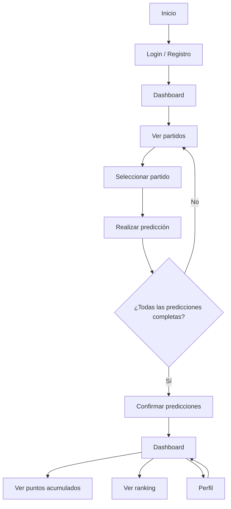
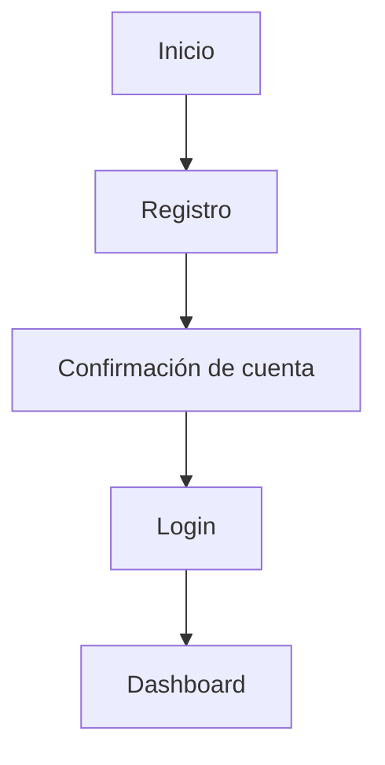
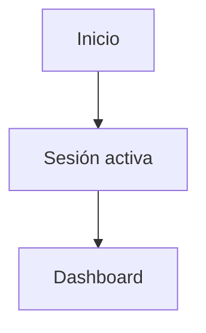
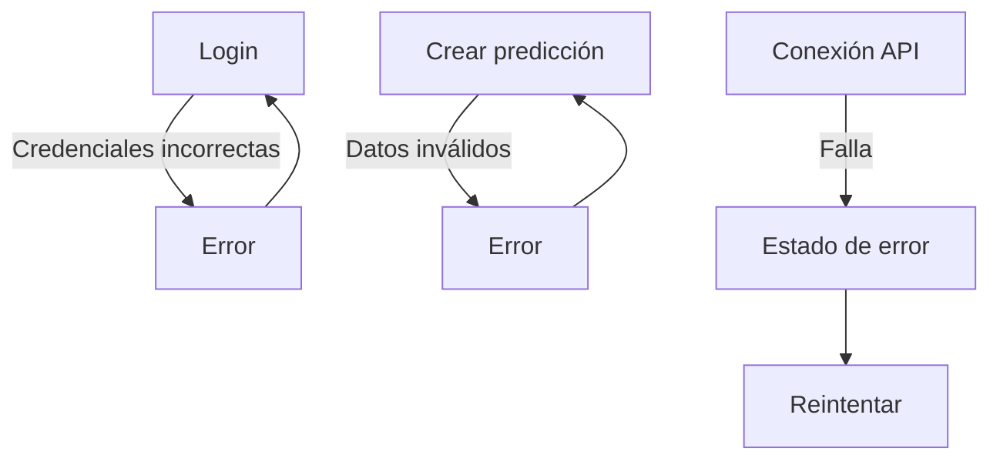

## User Flow - Flujo Principal (Happy Path)

## User Flow - Usuario Nuevo

**NOTA**: Quizas saltarse la confirmación estaria bien, pero podria darse el caso de llenarnos de cuentas basura.

## User Flow - Usuario Recurrente

## User Flow - Errores

## Reglas clave
- Las predicciones no deberian poder alterarse llegado cierto momento, definir con el equipo de backend, el como se manejara esta excepción.
- Los puntos se calculan automaticamente despues de cada partido